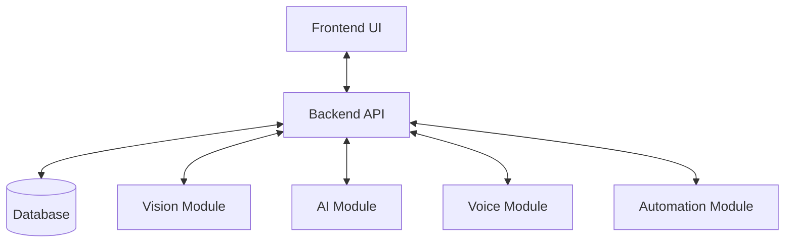

# 02. System Architecture

This document describes the high-level architecture and component layout of the VisionAI-OS system.

## 1. System Overview
VisionAI-OS is an integrated operating system/platform combining computer vision, AI capabilities, voice interface, and automated pipelines.

## 2. Architecture Diagram

## 3. Core Components
- **Frontend**: The user interface for configuration, monitoring, and control.
- **Backend**: Core orchestrator, API server, and business logic coordinator.
- **Vision**: Image and video processing pipelines.
- **AI Modules**: Deep learning models, LLM integrations, and cognitive services.
- **Voice**: Speech-to-text (STT) and text-to-speech (TTS) interfaces.
- **Automation**: Workflow engines, tasks, and script runners.
- **Database / Models**: Storage layer and data entities.
