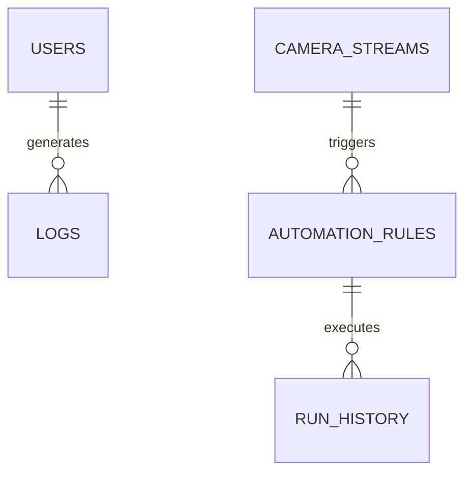

# 05. Database Design

This document details the schema design, tables, models, and storage strategies for VisionAI-OS.

## 1. Overview
The database layer manages users, vision/camera settings, automated workflows, AI configurations, and action logs.

## 2. Entity-Relationship Schema (Draft)

## 3. Data Tables / Collections
- **Users**: Authentication, profile settings, API keys.
- **Streams**: Camera stream URL, status, detection filters.
- **Rules**: Event triggers, automation scripts, conditions, actions.
- **Logs**: Execution logs, error reporting, performance metrics.
