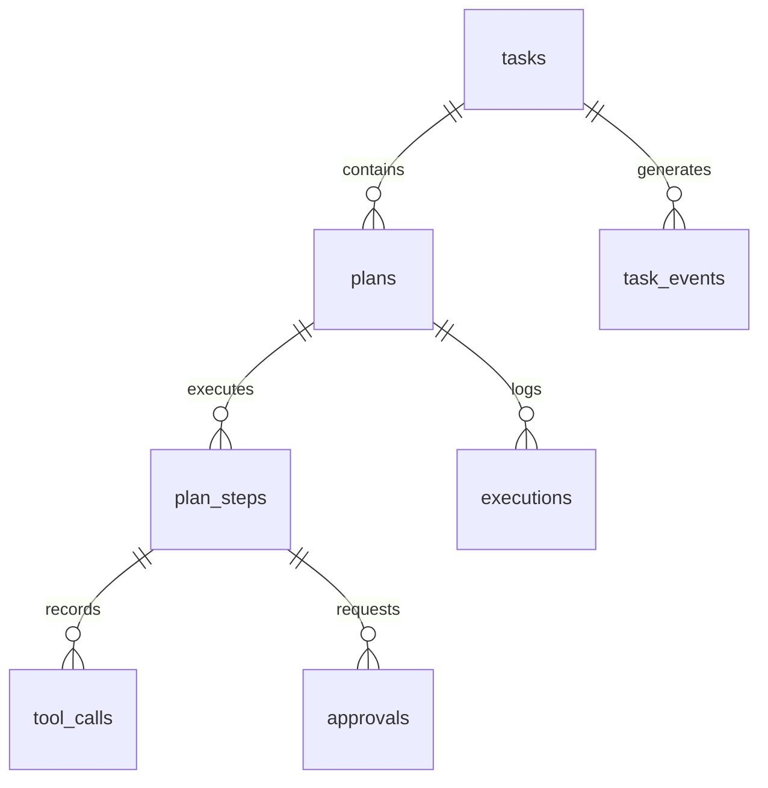
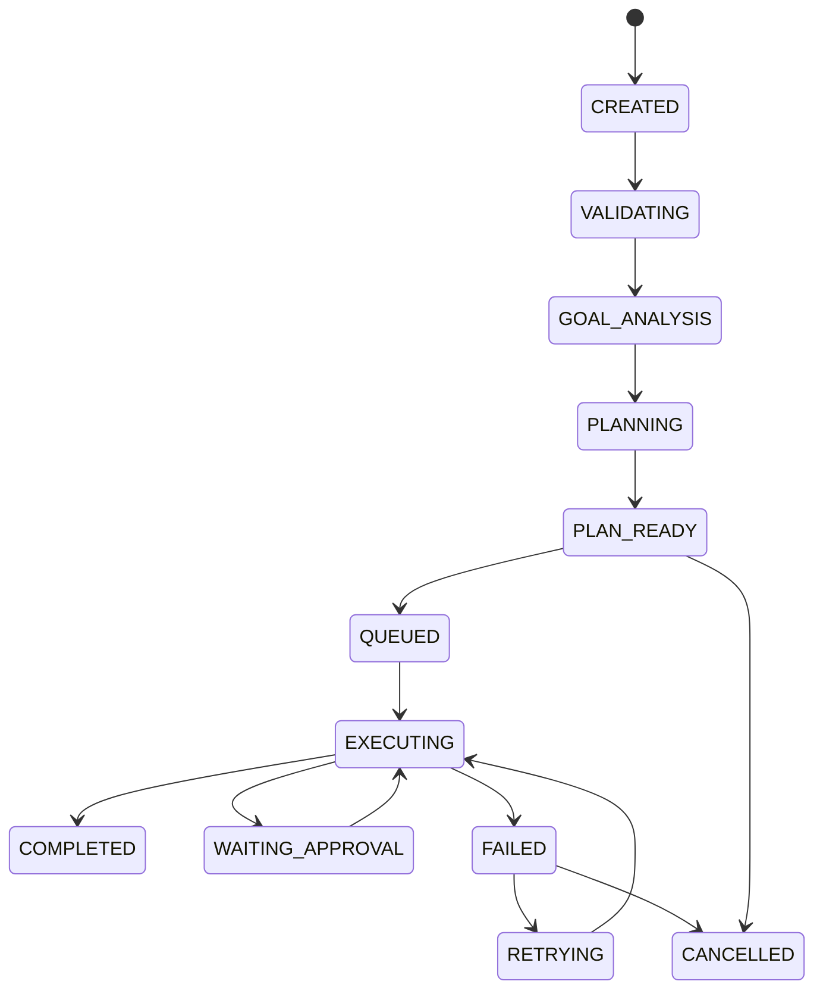
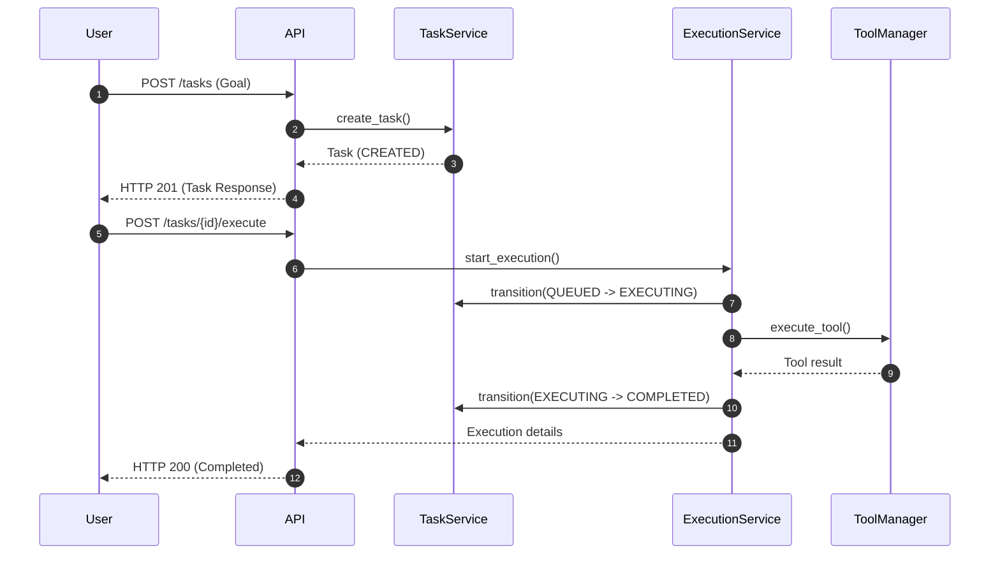

# Cover Page

**VisionAI OS**  
*Enterprise AI Operating System*

**Module 4: AI Task Execution & Intelligent Automation Engine Master Architecture & Roadmap Specification**

*   **Version**: 1.0.0
*   **Completion Date**: 2026-07-11
*   **Author**: Principal AI Systems Architect & Enterprise Security Lead
*   **Module Status**: Milestone 4.1 Completed/Frozen; Milestones 4.2–4.5 Planned
*   **Completion Percentage**: 100% (Specification-level)

---

# 2. Executive Summary

This document specifies the master enterprise architecture, structural components, database mappings, execution policies, and release roadmap for **Module 4: AI Task Execution & Intelligent Automation Engine** of VisionAI OS. 

Module 4 elevates VisionAI OS from a multi-turn chat framework (Module 2/3) into an autonomous, goal-oriented agent execution engine. By separating planning, execution, validation, and human-in-the-loop approvals, it safely drives local and network workflows. This blueprint guarantees compliance with modular Clean Architecture, security, and extensibility, facilitating integration with RAG databases (Module 5) and voice/camera pipelines (Module 6).

---

# 3. Business Goals

*   **Process Automation**: Transition manual web-form workflows and document scraping into secure, self-correcting agent tasks.
*   **Audit Compliance**: Maintain an immutable database audit log of all system plans, executed tools, arguments, and outcomes.
*   **Risk Abatement**: Mitigate execution errors by enforcing human-in-the-loop approvals for sensitive tools (e.g. database updates, emails).
*   **Operational Transparency**: Track real-time cost, token usage, and time metrics per workflow execution.

---

# 4. AI Goals

*   **Goal Decomposition**: Deconstruct complex user goals into logical, linear plan steps using high-context LLM models (Gemini-2.5).
*   **Tool Reasoning**: Select appropriate tools based on task descriptions and schema constraints.
*   **Error Correction**: Iterate autonomously if execution step results return errors, applying self-correction loops without failing the overall task.

---

# 5. Module Vision

Transform VisionAI OS from a reactive query platform:
```text
Question ──> LLM ──> Answer
```
into a proactive agent platform:
```text
Goal ──> Analyze ──> Plan ──> Approval (if needed) ──> Execute ──> Correct ──> Complete
```

---

# 6. Functional Scope

### In-Scope (Milestones 4.1 - 4.5)
*   Goal analysis and plan step generation.
*   Task state machine transitions.
*   Tool execution pipeline (Browser automation, Python sandbox, Local file system, Search, Vision, OCR).
*   Human approval gateways for sensitive steps.
*   Event-driven step tracking and metrics auditing.

### Out-of-Scope
*   Multi-agent negotiations (deferred to Module 6).
*   Vector semantic memory retrieval (deferred to Module 5 RAG).

---

# 7. Non-functional Requirements

*   **Thread Safety**: High-concurrency task transitions locked via Redis locks.
*   **Audit Integrity**: Task logs and events must remain immutable.
*   **Isolation**: Python executions sandboxed from the host OS.
*   **Performance**: SSE notifications streamed under 150ms chunk delay.
*   **Scalability**: Stateless background workers scaled horizontally.

---

# 8. Enterprise Architecture

VisionAI OS is organized under the clean modular layers of Domain-Driven Design (DDD).

### Modular Layering
```text
[ Presentation Layer ]  (FastAPI REST Endpoints, Swagger)
         │
         ▼
[ Application Layer ]   (Services: Planning, Execution, Approval, Task)
         │
         ▼
[ Domain Model Layer ]  (Entity definitions, Validations, Exceptions)
         │
         ▼
[ Infrastructure Layer] (Repositories, Postgres ORM, Redis Locks, EventBus)
```

---

# 9. System Architecture

The core flow coordinates the journey from a user's goal to execution.

### Execution Flow Sequence
```text
User ──> Conversation Engine ──> Goal Analyzer ──> Planner
                                                     │
  ┌──────────────────────────────────────────────────┘
  ▼
Plan Store ──> AI Orchestrator ──> Task Executor ──> Workflow Engine
                                                           │
                                ┌──────────────────────────┴──────────────────────────┐
                                ▼                                                     ▼
                          Tool Manager ──> Tool Registry ──> Plugin Tools       Result Collector
                                                                                      │
                                                                                      ▼
                                                                                   Memory ──> User
```

---

# 10. Backend Architecture

*   **Async-First Routing**: FastAPI controllers yield processing requests asynchronously to background workers.
*   **Repository decoupling**: Database sessions are parsed into repository classes, separating query building from model objects.
*   **Service Layer Orchestrators**: Logical states (e.g. Planning, Execution, Approvals) are managed by dedicated services.

---

# 11. Frontend Architecture

The user interface coordinates execution states in real-time:
*   **Stateful Panel Widget**: Visualizes planning blocks, current executing step numbers, tool outputs, and logs.
*   **Interactive Gateways**: Renders prompt modals requesting user confirmation when a plan step triggers `approval_required=True`.

---

# 12. Database Architecture

*   **Dialect-Agnostic Schema**: Models remain compatible with PostgreSQL (production) and SQLite (testing).
*   **Performance Indexing**: Indexes applied on `created_at`, `status`, and foreign keys.
*   **Optimistic locking**: Managed via native SQLAlchemy version counters.

---

# 13. Database Tables

### Table Relationship List
1.  `tasks`: Tracks global goal, state status, and lock version.
2.  `plans`: Summary of generated steps and cost metrics.
3.  `plan_steps`: Tool names, input JSON arguments, status, and approval flags.
4.  `executions`: Logs, durations, and retry counts.
5.  `task_events`: Event bus audit logs.
6.  `tool_calls`: Sub-step execution metrics.
7.  `approvals`: Triggers for human approval.
8.  `workflow_templates`: Pre-defined plan templates.

---

# 14. Entity Relationship Diagram (ERD)



---

# 15. Folder Structure Specifications

```text
backend/app/
├── api/
│   └── endpoints/
│       └── automation.py           # Endpoints for task, plan, execution, and approval CRUD
├── events/
│   ├── event_bus.py                # Abstract IEventBus interface and InMemory implementation
│   ├── event_dispatcher.py         # Coordinates event emissions
│   └── event_models.py             # Declarations for TaskCreated, TaskPlanning etc.
├── models/
│   └── automation.py               # SQLAlchemy ORM models with version_id_col mapper mapping
├── repositories/
│   ├── task_repository.py          # Database queries for tasks table
│   ├── plan_repository.py          # Database queries for plans & plan_steps
│   ├── execution_repository.py     # Database queries for executions table
│   ├── approval_repository.py      # Database queries for approvals table
│   └── tool_call_repository.py     # Database queries for tool_calls table
└── services/
    └── automation/
        ├── task_service.py         # Coordinates status transitions, logging & event publishing
        ├── planning_service.py     # Parses user goals and builds plan steps
        ├── execution_service.py    # Executes tools and records logs
        ├── approval_service.py     # Handles approval responses
        ├── state_machine.py        # Enforces valid task transitions
        └── exceptions.py           # Custom exception definitions
```

---

# 16. Domain Layer

Encapsulates core business models, status enumerations, and state transition maps:
*   **TaskStatus**: `CREATED`, `VALIDATING`, `GOAL_ANALYSIS`, `PLANNING`, `PLAN_READY`, `QUEUED`, `EXECUTING`, `WAITING_APPROVAL`, `COMPLETED`, `FAILED`, `RETRYING`, `CANCELLED`.
*   **State Machine Validation**: Rules rejecting illegal movements (e.g. `COMPLETED` -> `EXECUTING`).

---

# 17. Repository Layer

Responsible only for database access:
*   No business logic, commits, or rollbacks are allowed in repositories.
*   Bypasses ownership filters if `is_admin=True` is passed, supporting administrative overrides.
*   Atomic updates return `None` if version numbers do not match database records.

---

# 18. Service Layer

Orchestrates business operations:
*   Manages database session transactions (commits on success, rollbacks on failure).
*   Enforces state transition rules via `TaskService`.
*   Publishes events to the EventBus *only after* a successful database commit.
*   Outputs structured JSON transition logs.

---

# 19. API Layer

*   **Consistent Response Format**: All endpoints return `ApiResponse[T]` payload templates:
    ```json
    {
      "success": true,
      "message": "Action completed successfully",
      "data": {}
    }
    ```
*   **Validation**: Uses Pydantic to validate input schemas, raising `RequestValidationError` (HTTP 422) if fields are missing or invalid.

---

# 20. Authentication

*   All routes depend on `Depends(get_current_user)`.
*   Verifies incoming HTTP headers for valid Bearer access tokens.

---

# 21. Authorization

Enforces resource boundaries:
*   All operations filter by `user_id == current_user.id` to prevent cross-tenant access.

---

# 22. Role-Based Access Control (RBAC)

*   `RoleChecker` dependency validates user roles before granting access to sensitive admin operations.

---

# 23. Goal Analyzer

*   Analyzes user goals to determine complexity, resource constraints, and tool requirements.

---

# 24. Planner

*   Generates a linear sequence of plan steps.
*   Maps step requirements to concrete tool schemas.
*   Enforces planning rules without executing tools.

---

# 25. Execution Plan

A generated plan contains:
*   Estimated duration and cost.
*   A list of steps, arguments, and approval constraints.

---

# 26. Execution Plan Store

*   Saves and retrieves versioned plans in the database.
*   Maintains a history of generated plans.

---

# 27. AI Orchestrator

The coordinator of the agent execution engine:
*   Validates plans.
*   Triggers step executions.
*   Handles execution failures.

---

# 28. Task Executor

*   Coordinates individual step executions.
*   Submits arguments to the Tool Manager.

---

# 29. Task Scheduler

*   Schedules recurring workflows and schedules tasks for execution.

---

# 30. Task State Machine

### Transition Diagram


---

# 31. Workflow Engine

*   Executes plans sequentially.
*   Monitors execution state and logs outcomes.

---

# 32. Background Workers

*   FastAPI background task worker pools run asynchronous tasks without blocking the main request loop.

---

# 33. Retry Manager

*   Handles transient failures.
*   Enforces maximum retry limits and backoff rules.

---

# 34. Human Approval System

*   Pauses execution if a step requires approval (`approval_required=True`), transitioning the task to `WAITING_APPROVAL`.
*   Resumes execution once approved or marks the task as `FAILED` if rejected.

---

# 35. Tool Manager

*   Validates arguments against schemas.
*   Executes registered tools.
*   Cleans up tool resources when the overall task terminates.

---

# 36. Tool Registry

*   A registry mapping tool names to concrete class instances.
*   Supports dynamic registration of new tools.

---

# 37. Plugin Tool Architecture

*   Concrete tools implement the `BaseTool` interface, defining names, input/output schemas, validations, execution paths, and cleanups.

---

# 38. Browser Tool

*   Drives headful or headless browser sessions (via Playwright) to scrape data, input values, and click buttons.

---

# 39. Python Sandbox Tool

*   Executes arbitrary Python code in isolated sandboxes to analyze data or perform mathematical calculations.

---

# 40. File System Tool

*   Reads, writes, lists, and deletes files in designated local sandbox workspace directories.

---

# 41. Search Tool

*   Performs web searches to retrieve real-time information.

---

# 42. Vision Tool

*   Analyzes images and generates visual descriptions.

---

# 43. OCR Tool

*   Extracts text from images and documents.

---

# 44. Email Tool

*   Sends emails (requires human approval).

---

# 45. Calendar Tool

*   Retrieves and schedules calendar events.

---

# 46. Calculator Tool

*   Performs mathematical operations.

---

# 47. Future Tool Interface

To add a new tool (e.g. `GitHubTool`):
1. Create a class implementing `BaseTool`.
2. Register the tool with the central registry:
   ```python
   tool_registry.register(GitHubTool())
   ```

---

# 48. Event Bus

*   Interface-based event publishing decoupled from concrete subscriber engines.

---

# 49. Event Dispatcher

*   Dispatches events asynchronously to the event bus.

---

# 50. Contextual Memory Integration

*   Retrieves short-term context from conversation logs.

---

# 51. Logging

*   Structured logging tracks all execution transitions and tool executions.

---

# 52. Monitoring

*   Tracks active task status distributions, latency metrics, and error rates.

---

# 53. Metrics Auditing

*   Logs token usage, execution durations, and estimated API costs in `token_usage` tables.

---

# 54. Health Checks

*   Health check endpoints monitor service, database, and Redis connectivity.

---

# 55. Redis Caching & Locks

*   Redis handles concurrency locks and real-time generation status tracking.

---

# 56. Docker Containers Isolation

*   Docker containers isolate service processes, PostgreSQL databases, and Redis caches.

---

# 57. Docker Compose Integration

*   Docker Compose manages the local container networking and volumes setup.

---

# 58. Deployment Strategy

*   Stateless backend instances run behind a reverse proxy, sharing access to the Postgres cluster and Redis sentinel pools.

---

# 59. Security Model

*   Validates input schemas, enforces authorization boundaries, and sandboxes execution environments.

---

# 60. Secrets Management

*   Environment secrets (database passwords, API keys) are loaded from system environment variables.

---

# 61. Audit Logging

*   Immutable audit logs record task changes, tool calls, and human approvals.

---

# 62. Structured Log Specification

Every transition writes a structured log payload:
```json
{
  "event": "state_transition",
  "task_id": "uuid",
  "previous_state": "PLANNING",
  "new_state": "PLAN_READY",
  "user_id": 1,
  "timestamp": "ISO-8601-UTC"
}
```

---

# 63. Rate Limiting

*   Enforces request limits per user to prevent API quota exhaustion.

---

# 64. Exception Mapping

*   Global exception handlers map custom exceptions to consistent HTTP response codes.

---

# 65. Exception Hierarchy

*   `AutomationError`
    *   `InvalidStateTransitionError` (HTTP 400)
    *   `ConcurrencyConflictError` (HTTP 409)
    *   `ApprovalRequiredError` (HTTP 403)
    *   `ExecutionNotFoundError` (HTTP 404)
    *   `TaskNotFoundError` (HTTP 404)

---

# 66. Transaction Management

*   The service layer manages transactions, rolling back changes if any database operation fails.

---

# 67. Optimistic Locking

*   Enforced on database models via version columns to handle concurrent modifications.

---

# 68. Concurrency Limits

*   Enforces execution concurrency limits per user to prevent resource exhaustion.

---

# 69. Performance Optimizations

*   Lazy loading properties default to `lazy="selectin"` on relationships to prevent N+1 queries.

---

# 70. Scalability

*   Stateless workers scale horizontally to handle increased workloads.

---

# 71. Horizontal Scaling

*   Load balancers distribute traffic across multiple backend service instances.

---

# 72. Background Worker Scaling

*   Supports scaling background worker instances independently from web request handlers.

---

# 73. Database Scaling

*   Supports read replicas to distribute query loads.

---

# 74. Testing Strategy

*   Comprehensive testing covers units, services, repositories, APIs, workflows, and security.

---

# 75. Unit Testing

*   Tests verify the state machine validation logic.

---

# 76. Integration Testing

*   Tests verify end-to-end database transactions and service integrations.

---

# 77. API Testing

*   Verifies HTTP response formats, status codes, and validation error envelopes.

---

# 78. Workflow Testing

*   Simulates complete planning and execution loops.

---

# 79. Load Testing

*   Verifies performance under high request concurrency.

---

# 80. Security Verification

*   Verifies authorization limits and RBAC enforcement.

---

# 81. OpenAPI/Swagger

*   Verifies OpenAPI definitions and Swagger documentation.

---

# 82. Execution Sequence Diagram



---

# 83. State Machine Transition Diagram

[Refer to Section 30 for the complete state transition flow]

---

# 84. Workflow Orchestration Diagram

```text
[Goal Ingestion] ──> [Plan Step Generation] ──> [Approval Checks]
                                                       │
                       ┌───────────────────────────────┴───────────────────────────────┐
                       ▼ (Requires Approval)                                           ▼ (No Approval)
            [Pause & Transition Status]                                      [Trigger Tool Execution]
```

---

# 85. System Component Architecture

```text
     [Web Interface]
           │
           ▼
    [FastAPI Router] ──> [Auth Verification]
           │
           ▼
    [Service Layer]  ──> [State Machine Verification]
           │
           ▼
[Repositories Layer] ──> [PostgreSQL / Redis]
```

---

# 86. ASCII Infrastructure Mapping

```text
Docker Stack:
  [ Nginx:3000 ] ──> [ FastAPI:8000 ] ──> [ PostgreSQL:5432 ]
                                      ──> [ Redis:6379 ]
```

---

# 87. Backend Folder Tree Layout

[Refer to Section 15 for the project folder tree]

---

# 88. Module Dependencies

```text
Module 1 (Auth Base) <── Module 2 (Chats) <── Module 3 (Files) <── Module 4 (Engine)
```

---

# 89. Development Milestones

1.  **Milestone 4.1**: Engine foundations, optimistic locking, and state machine transitions (COMPLETED).
2.  **Milestone 4.2**: Core tool implementations (Browser, Python, Sandbox).
3.  **Milestone 4.3**: Human approval system integration.
4.  **Milestone 4.4**: Orchestrator, scheduler, and background task scaling.
5.  **Milestone 4.5**: Testing, security audits, and deployment stabilization.

---

# 90. Phase-by-Phase Roadmap

*   **Phase 1 (Milestone 4.1)**: Base schema migrations, repositories creation, and state validation (COMPLETED).
*   **Phase 2 (Milestone 4.2 - 4.3)**: Sandbox execution isolation and approval UI indicators.
*   **Phase 3 (Milestone 4.4 - 4.5)**: Distributed background worker scaling and performance optimization.

---

# 91. Risk Analysis & Mitigations

*   **Rate Limits (Gemini API)**: Excessive requests may trigger HTTP 429 errors.
    *   *Mitigation*: Implement exponential backoff retry rules and local token limit trackers.
*   **Sandbox Security Violations**: Arbitrary code execution may expose host resources.
    *   *Mitigation*: Run code execution inside Docker sandboxes with limited access permissions.

---

# 92. Technical Debt Strategy

*   **Templates Registry**: Extract templates to a separate table/module.
*   **Audit Archiving**: Implement background jobs to archive old execution logs.

---

# 93. Future Extensions

*   **Distributed Workers**: Move background workers to Celery or RabbitMQ.

---

# 94. Module 5 (RAG) Integration

*   **Design**: The orchestrator can access vector index tools to search local files without modifying the execution logic.

---

# 95. Module 6 (Multi-Agent) Integration

*   **Design**: The orchestrator can spawn sub-agents to execute tasks, passing execution contexts via the Event Bus.

---

# 96. Production Readiness Checklist

*   [x] Database tables and migrations applied.
*   [x] Optimistic locking enabled.
*   [x] Custom exception handlers registered.
*   [x] Standardized model configuration.
*   [x] Eager relationship loading configured.
*   [x] Unit and integration tests passing.

---

# 97. Module Completion Criteria

The module is complete when the orchestrator is able to generate plans, request approvals, execute tools, handle errors, and return results cleanly.

---

# Enterprise Architecture Review
The decoupling of layers (DDD, Clean Architecture) ensures the engine remains extensible. It allows swapping providers, adding tools, or migrating databases without breaking existing API contracts.

# Scalability Review
Stateless worker processes, Redis locking, and database pooling allow the system to scale horizontally to support high workloads.

# Security Review
Strict authentication, resource boundaries, input validation, and code execution sandboxing keep user data and host systems secure.

# Production Readiness Review
With database revisions, error handling, structured logging, and concurrency controls in place, the engine foundation is stable and ready for production staging.
